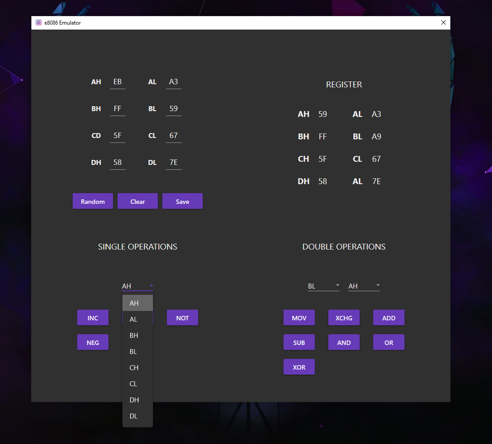

 

  

  <h2 align="center">An Intel 8086 emulator</h1>

 

The Intel 8086 Emulator (written in C#) is a project that emulates the behavior of the Intel 8086 microprocessor's register-based operations using the C# programming language. It provides a simulated environment where users can interact with registers, insert data, and perform single or double operations on them. The emulator offers a user-friendly interface for data input, register manipulation, and executing operations.

 

## Features

- **Register Operations**: The emulator allows users to work with the registers of the Intel 8086 microprocessor. Users can insert data into registers and perform various operations on them.
- **Single Operations**: Users can choose from a set of single operations, including increment (inc), decrement (dec), bitwise complement (not), and negation (neg), to modify the values stored in the registers.
- **Double Operations**: The emulator supports double operations such as move (mov), exchange (xchg), addition (add), subtraction (sub), logical AND (and), logical OR (or), and logical XOR (xor). These operations can be used to perform arithmetic, logical, and data transfer operations between registers.
- **User Input**: Users can input data into the registers, specifying the values they want to work with in the emulation environment.
- **User-Friendly Interface**: The project provides an intuitive interface that simplifies the process of inserting data, selecting operations, and viewing the results.

 

## Getting Started

To use the Intel 8086 Emulator (written in C#), follow these steps:

1. Clone or download the project repository.
2. Open the project in a C# integrated development environment (IDE) such as Visual Studio.
3. Build the project to generate the executable or run it directly from the IDE.
4. Enter the desired values into the registers using the provided input mechanism.
5. Select the operation you want to perform, either a single operation (inc, dec, not, neg) or a double operation (mov, xchg, add, sub, and, or, xor).
6. View the updated register values and any output generated by the operation.

 

## License

The Intel 8086 Emulator project (written in C#) is released under the [MIT License](https://opensource.org/licenses/MIT). Please review the license file for more information.

